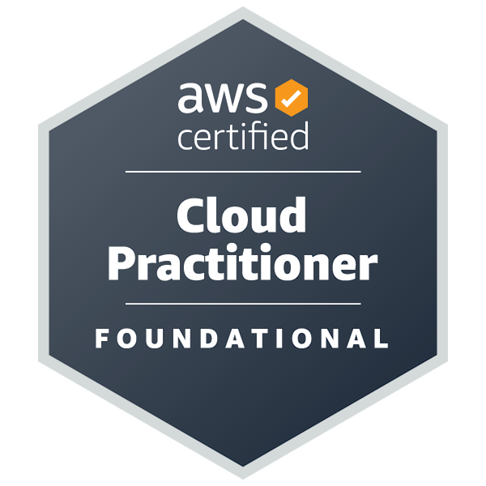
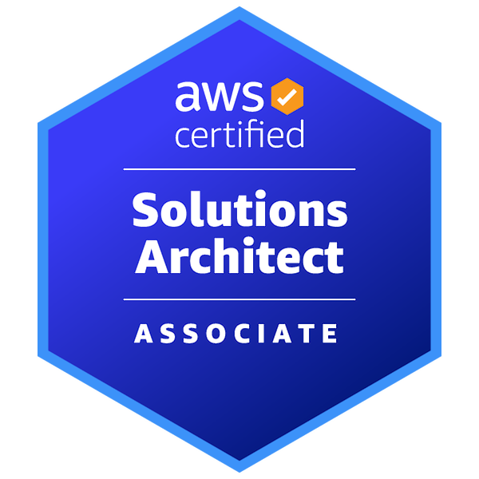
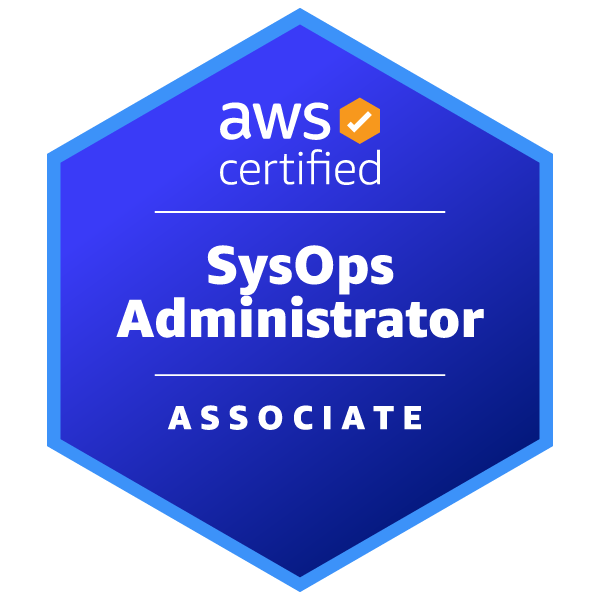
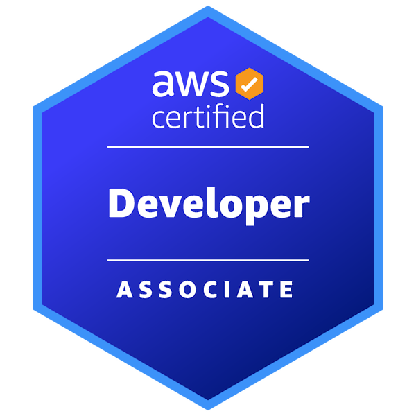

  
  
  
  
<!--   <a href="https://www.reddit.com/user/GOD-oda"> -->
<!--      -->
<!--   </a> -->
<!--   <a href="https://stackoverflow.com/users/5720201/GOD-oda"> -->
<!--      -->
<!--   </a> -->
<!--   <a href="http://qiita.com/GOD-oda"> -->
<!--      -->
<!--   </a> -->
<!--   <//qiita.com/GOD-oda"> -->
<!--      -->
<!--   </a> -->

# Certifications

## AWS

### Foundational

### Associate

### Professional

### Specialty

## GCP

### Foundational level

### Associate

### Professional

### Expert level
